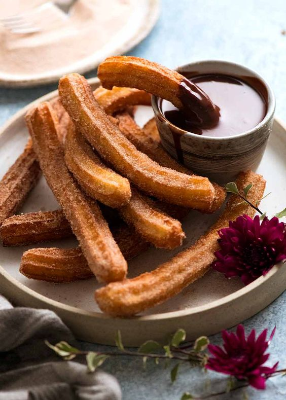

<!DOCTYPE html>
<html lang="en">
  <head>
    <meta charset="UTF-8">
    <meta name="viewport" content="width=device-width, initial-scale=1.0">
    <title>Spice Route</title>
    <!-- Add the Bootstrap CSS stylesheet link here -->
    <link rel="stylesheet" href="https://stackpath.bootstrapcdn.com/bootstrap/4.3.1/css/bootstrap.min.css" integrity="sha384-ggOyR0iXCbMQv3Xipma34MD+dH/1fQ784/j6cY/iJTQUOhcWr7x9JvoRxT2MZw1T" crossorigin="anonymous">
  </head>
  <body>
    <header>
      <nav class="navbar navbar-expand-lg navbar-light bg-light">
        <a class="navbar-brand" href="#">Spice Route</a>
        <button class="navbar-toggler" type="button" data-toggle="collapse" data-target="#navbarNav" aria-controls="navbarNav" aria-expanded="false" aria-label="Toggle navigation">
          
        </button>
        

          <ul class="navbar-nav">
            <li class="nav-item">
              <a class="nav-link" href="#menu">Menu</a>
            </li>
            <li class="nav-item">
              <a class="nav-link" href="#contact">Contact Us</a>
            </li>
          </ul>
        

      </nav>
    </header>
    <body>
    <main>
      <section id="hero" class="jumbotron text-center" style="background-color:lavenderblush;">
        <h1 class="display-2">Welcome to Spice Route!</h1>
        
Whether you're in the mood for something sweet, savory, or spicy, our restaurant has something for every palate.

        

      </section>
      <section id="menu" class="container" style="background-color: whitesmoke;">
        <h2 class="text-center">Menu</h2>
        
From classic favorites to innovative new creations, our menu has something for everyone to enjoy.

        

          <!-- Add your menu items here using Bootstrap cards -->
          

            

              
              

                <h5 class="card-title">Paella</h5>
                
Paella is a traditional Spanish rice dish that originated in the Valencia region of Spain. It is typically made with short-grain rice that is cooked in a large, shallow pan and flavored with saffron, a spice that gives the dish its distinctive golden color and rich, aromatic flavor.
                

              

            

          

          

            

              
              

                <h5 class="card-title">Fish & Chips</h5>
                
Fish and chips is a classic dish that originated in the United Kingdom and has become popular around the world. The dish typically consists of deep-fried battered fish, usually cod or haddock, and thick-cut potato chips or French fries.
                     The sauce is typically thick and creamy, and the flavors are further enhanced by the addition of shrimp paste or bagoong.
                

              

            

          

          

            

              
              

                <h5 class="card-title">Churros</h5>
                
Churros are a traditional Spanish dessert that have become popular around the world. These fried dough pastries are typically long and thin, with a ridged exterior that gives them a crispy texture. They are often served warm and dusted with cinnamon sugar or drizzled with chocolate sauce for a sweet and satisfying treat.
                

              

            

          

    </section>
    

    <footer id="contact" class="container">
        <h2 class="text-center">Contact Us</h2>
         
        <h3 class="text-center">09123456789</h3>
         
        <h3 class="text-center">1234-421-234</h3>
         
    </footer>

    </body>
    </html>
